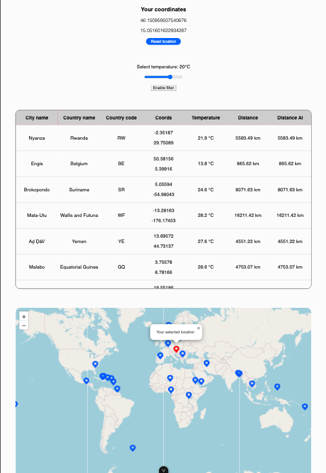

# 🌍 City Distance App

A web app that displays the distance from the user's location (or a selected city) to 25 randomly selected cities across the globe. Built with [Vue.js](https://vuejs.org/) and powered by location data, temperature filtering, and interactive maps.

## ✨ Features

- ✅ **Loads Cities from Local Server**
- ✅ **Gets User's Current Location**
- ✅ **Calculates Distance Using Custom & AI-Generated Haversine Formula**
- ✅ **Displays a Fully Responsive, Scrollable Table**
- ✅ **Click a Row to Set That City as the New Origin**
- ✅ **Displays Real-Time Temperature per City (via Open-Meteo API)**
- ✅ **Temperature Slider to Filter Cities by Min Temp**
- ✅ **Interactive Map with All 25 Cities Marked**
- ✅ **Click Marker ➝ Set Location and Recalculate Table**

## 🖼 Preview



## 📦 Project Structure

```bash
.
├── app_next         # Next.js version of the app (port 3000)
├── app_vue          # Vue.js version of the app (port 3001)
├── local-server     # JSON server config (port 3002)
├── screenshots      # app preview for README.md
└── assets/
    └── cities.json  # List of all cities with metadata
```

## 🛠 Setup

```bash
# Start local JSON server
cd local-server
npm install
npm start

# Start Vue app
cd app_vue
npm install
npm run dev

# Start Next app
cd app_next
npm install
npm run dev
```

* Vue app runs on `http://localhost:3001`
* JSON server runs on `http://localhost:3002`

## 📐 Distance Calculation

Two columns in table show distances calculated using:
* **My Custom Formula** – [an original Haversine implementation](https://www.movable-type.co.uk/scripts/latlong.html)
* **AI-Generated Formula** – written using ChatGPT guidance

Here's my integration with added explanation:

```ts
/**
 * Calculates the great-circle distance between two points on Earth using the Haversine formula.
 * 
 * The Haversine formula determines the shortest distance between two points on a sphere
 * using their latitudes and longitudes measured along the surface.
 * 
 * @param lat1 - Latitude of the first point in decimal degrees
 * @param lat2 - Latitude of the second point in decimal degrees
 * @param lng1 - Longitude of the first point in decimal degrees
 * @param lng2 - Longitude of the second point in decimal degrees
 * @returns The distance between the two points in kilometers, rounded to 2 decimal places
 */
const myHaversineDistance = (lat1: number, lat2: number, lng1: number, lng2: number): number => {
    // Earth's radius in kilometers
    const earthRadius: number = 6371;

    // Convert latitude values from degrees to radians
    const alpha1: number = (lat1 * Math.PI) / 180;
    const alpha2: number = (lat2 * Math.PI) / 180;

    // Calculate differences in coordinates and convert to radians
    const beta: number = ((lat2 - lat1) * Math.PI) / 180;   // Difference in latitude
    const gamma: number = ((lng2 - lng1) * Math.PI) / 180;  // Difference in longitude

    // Calculate the square of half the chord length between the points
    const a: number =
        Math.sin(beta / 2) * Math.sin(beta / 2) +
        Math.cos(alpha1) * Math.cos(alpha2) * Math.sin(gamma / 2) * Math.sin(gamma / 2);

    // Calculate the angular distance in radians
    const c: number = 2 * Math.atan2(Math.sqrt(a), Math.sqrt(1 - a));

    // Calculate the distance in kilometers and round to 2 decimal places
    const distance: number = parseFloat((earthRadius * c).toFixed(2));

    return distance;
};
```

## 🤖 Use of AI

AI ([ChatGPT](https://chatgpt.com/)/[Claude](https://claude.ai/)/[Gemini](https://gemini.google.com/app)) was used to:
* Refactor and validate the Haversine formula implementation
* Help migrate from [Next.js](https://nextjs.org/) to [Vue.js](https://vuejs.org/)
* Guide integration of external API ([Open-Meteo](https://open-meteo.com/))
* Assist in [Leaflet](https://leafletjs.com/) map implementation and interactive features
* Assist in writing clean, modular code
* Create this README.md file

The AI-generated distance formula is based on the same Haversine logic but reworded via AI suggestions.

